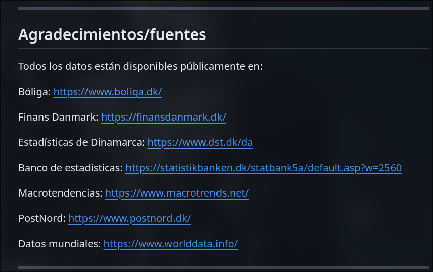
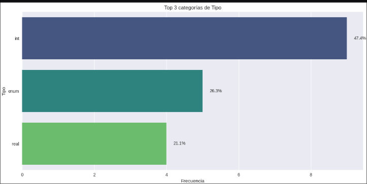
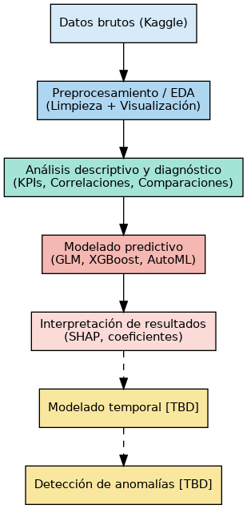
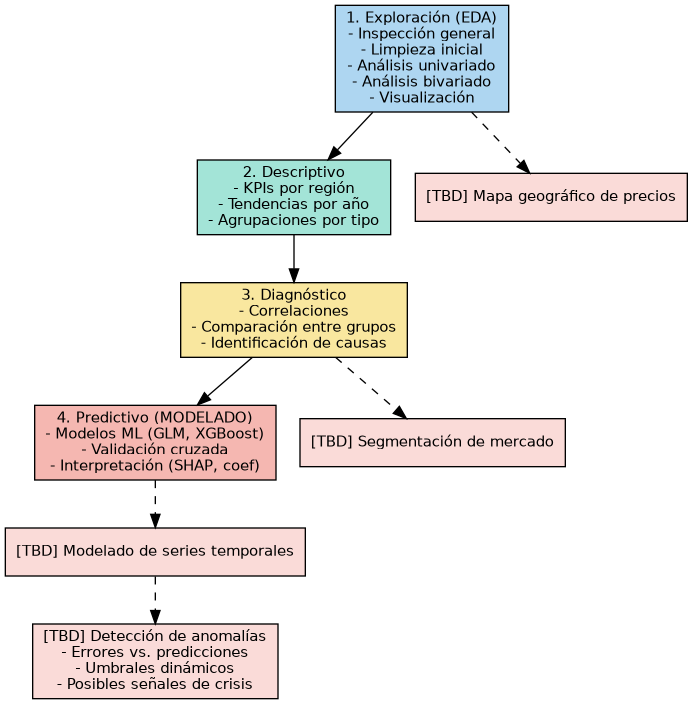
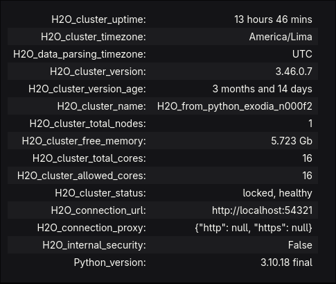
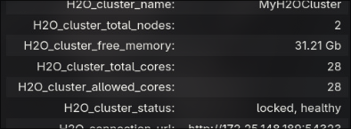
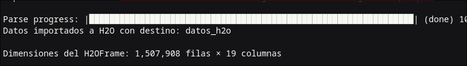

#  Análisis exploratorio y modelado predictivo de precios residenciales en Dinamarca (1992–2024)

Kaggle dataset: [Danish Residential Housing Prices 1992-2024](https://www.kaggle.com/datasets/martinfrederiksen/danish-residential-housing-prices-1992-2024/data) 


## 1. Descripción del caso de uso

El precio de la vivienda es un tema socioeconómico de gran relevancia, pues la compra de una casa suele ser la inversión más importante en la vida de una familia[1]. En Dinamarca, al igual que en muchos países, el mercado inmobiliario ha experimentado notables alzas de precios en las últimas décadas. Por ejemplo, el precio promedio de una vivienda unifamiliar aumentó **153,9% en términos reales** entre 1992 y 2020[2]. Estas fluctuaciones incluyen periodos de **boom** seguidos de ajustes: antes de la crisis financiera de 2008 los precios crecieron aceleradamente y luego cayeron \~20% para 2009, recuperándose en la década siguiente[2]. Este comportamiento cíclico ha generado interrogantes sobre la existencia de burbujas inmobiliarias y la sostenibilidad de los precios respecto a fundamentos económicos[2].

Dada la importancia de la vivienda tanto para la economía nacional como para el bienestar social, **analizar y predecir los precios de las viviendas** resulta fundamental. Una predicción precisa ayuda a compradores y vendedores a tomar decisiones informadas, a la vez que permite a planificadores y entidades financieras evaluar riesgos. Modelos de *machine learning* ya han mostrado eficacia en la predicción de precios inmobiliarios[4], pudiendo descubrir patrones ocultos en los datos históricos. En este proyecto, proponemos aplicar técnicas de Big Data y aprendizaje supervisado para **encontrar patrones y predecir el precio de viviendas residenciales en Dinamarca** usando datos históricos de 1992 a 2024. Se busca no solo alta precisión predictiva sino también **interpretabilidad**, de modo que los resultados brinden conocimiento claro sobre **qué factores influyen** en el precio (por ejemplo, ubicación, tamaño, antigüedad, etc.). Esto está alineado con la tendencia hacia **IA explicable**, utilizando métodos como SHAP o LIME para interpretar modelos complejos[5]. En resumen, el caso de uso se enfoca en demostrar cómo el análisis de grandes volúmenes de datos inmobiliarios puede apoyar la toma de decisiones en el mercado de la vivienda, un ámbito de gran impacto económico y social.

---
## 2. Descripción del conjunto de datos

El conjunto de datos utilizado proviene de la plataforma Kaggle (aporte de Martin Frederiksen, 2024) e incluye ~1,5 millones de registros de ventas de viviendas residenciales en Dinamarca, cubriendo el período 1992 a 2024. Cada fila representa una transacción inmobiliaria residencial real durante esos 32 años, recopiladas originalmente de registros oficiales de ventas. El dataset completo (`.parquet`) contiene aproximadamente **1.5 millones de registros** de ventas de viviendas residenciales en Dinamarca durante el período **1992 a 2024**.


### 2.1 Procedencia y recopilación

* Los datos fueron recolectados mediante técnicas de **web scraping**, ejecutadas sobre fuentes públicas como:

  * El portal inmobiliario **Boliga**.
  * Sitios oficiales de estadísticas danesas, como **Statistikbanken** y **Danmarks Statistik**.

* La recolección se llevó a cabo usando **scripts en Python**, ejecutados en notebooks Jupyter del repositorio público del autor.


_- Fuentes primarias del dataset de Kaggle (repositorio de Martin Frederiksen)_

### 2.2 Proceso de limpieza y estructuración

* Se descargaron más de **80 archivos CSV** comprimidos, ubicados en la carpeta *Housing\_data\_raw*, utilizando el notebook `Webscrape_script.ipynb`.

* Posteriormente, el notebook `BoligsalgConcatCleaningGit.ipynb` concatenó, depuró y estructuró los datos mediante:

  * Estandarización de formatos (fechas, precios, áreas).
  * Eliminación de valores inválidos o simbólicos (como guiones ‘–’).
  * Filtrado o imputación de datos faltantes según reglas definidas.

### 2.3 Enriquecimiento de variables

* A los datos transaccionales se integraron variables **macroeconómicas y geográficas**, tales como:

  * **Tasas de inflación e interés.**
  * **Datos hipotecarios históricos.**
  * **Códigos postales y regiones administrativas.**

* Estos datos complementarios se extrajeron de fuentes públicas adicionales y se incorporaron desde la carpeta *Additional\_data* del repositorio original.

### 2.4 Estructura final del dataset

* El resultado final consiste en **dos archivos `.parquet`** (`DKHousingprices_1` y `DKHousingprices_2`) que contienen:

  * Datos consolidados, limpios y estructurados.
  * Variables clave como: fecha de venta, precio, tipo de propiedad, superficie, número de habitaciones y ubicación.
  * Integración de contexto económico y geográfico para potenciar análisis predictivos y exploratorios.

[Link de repositorio del proceso de mineria y limpieza de datos llevado a cabo por Martin Frederiksen](https://github.com/MartinSamFred/Danish-residential-housingPrices-1992-2024)


---

## 🏷️ Columnas disponibles (Cleaned files)

| Nº  | Nombre columna                                 | Descripción                                                                                         | Observaciones                            |
|-----|------------------------------------------------|-----------------------------------------------------------------------------------------------------|------------------------------------------|
| 0   | `date`                                         | Fecha de la transacción                                                                             | —                                        |
| 1   | `quarter`                                      | Trimestre según calendario estándar                                                                 | —                                        |
| 2   | `house_id`                                     | ID único de vivienda                                                                                | Puede eliminarse                         |
| 3   | `house_type`                                   | Tipo de vivienda: `'Villa'`, `'Farm'`, `'Summerhouse'`, `'Apartment'`, `'Townhouse'`               | —                                        |
| 4   | `sales_type`                                   | Tipo de venta: `'regular_sale'`, `'family_sale'`, `'other_sale'`, `'auction'`, `'-'`              | `'-'` puede eliminarse                   |
| 5   | `year_build`                                   | Año de construcción (rango 1000–2024)                                                               | Se puede restringir más                  |
| 6   | `purchase_price`                               | Precio de compra en coronas danesas (DKK)                                                           | —                                        |
| 7   | `%_change_between_offer_and_purchase`          | Variación % entre precio ofertado y precio de compra                                                | Puede ser negativa, cero o positiva      |
| 8   | `no_rooms`                                     | Número de habitaciones                                                                              | —                                        |
| 9   | `sqm`                                          | Metros cuadrados                                                                                   | —                                        |
| 10  | `sqm_price`                                    | Precio por metro cuadrado (precio_compra / metros cuadrados)                                        | —                                        |
| 11  | `address`                                      | Dirección                                                                                           | —                                        |
| 12  | `zip_code`                                     | Código postal                                                                                       | —                                        |
| 13  | `city`                                         | Ciudad                                                                                              | —                                        |
| 14  | `area`                                         | Área geográfica: `'East & mid jutland'`, `'North jutland'`, `'Other islands'`, `'Copenhagen'`, etc. | —                                        |
| 15  | `region`                                       | Región: `'Jutland'`, `'Zealand'`, `'Fyn & islands'`, `'Bornholm'`                                   | —                                        |
| 16  | `nom_interest_rate%`                           | Tasa de interés nominal danesa por trimestre (no convertida a formato trimestral)                  | —                                        |
| 17  | `dk_ann_infl_rate%`                            | Tasa de inflación anual danesa por trimestre (no convertida)                                       | —                                        |
| 18  | `yield_on_mortgage_credit_bonds%`              | Tasa de bonos hipotecarios a 30 años (sin spread)                                                   | —                                        |
<p align="center">
  
</p>

<p align="center"><em>Figura V. Distribución de categorías por tipo</em></p>


Se observa que la mayoría de las columnas contienen datos **numéricos**, lo cual es favorable para su análisis y posterior modelado.


---

## 3. Enfoque metodológico

### Objetivo general

Desarrollar un análisis exploratorio (EDA) y un modelo predictivo explicable de los precios de viviendas residenciales en Dinamarca entre 1992 y 2024, utilizando técnicas de Big Data para identificar patrones, factores relevantes y posibles anomalías en el mercado inmobiliario. (cita al informe)

---

### Objetivos específicos

1. **Explorar y limpiar** el dataset de precios de viviendas, identificando valores atípicos y patrones generales.
2. **Analizar** de forma univariada y bivariada las variables clave (precios, metros cuadrados, ubicación, etc.).
3. **Determinar** relaciones entre variables que influyen significativamente en el precio de una vivienda.
4. **Construir** modelos supervisados de predicción de precios, priorizando precisión e interpretabilidad.
5. **Detectar** posibles anomalías estructurales en el mercado, como burbujas o rupturas de tendencia, usando análisis de residuales en series temporales.

---

### Preguntas orientadoras

* ¿Qué factores tienen mayor impacto en el precio de una vivienda en Dinamarca?
* ¿Qué diferencias existen entre regiones y tipos de vivienda?
* ¿Se pueden detectar cambios anómalos o inusuales en el mercado a lo largo del tiempo?
* ¿Qué tan precisas y explicables pueden ser las predicciones de precios usando modelos de ML?

---

### Metodología general

* **Tipo de estudio**: Cuantitativo, correlacional, longitudinal (1992–2024).
* **Enfoque**: Basado en ciencia de datos y aprendizaje automático.
* **Técnicas**:

  * Limpieza y transformación de datos con H2O/Pandas
  * EDA con análisis univariado, bivariado y visualización
  * Modelado predictivo con H2O AutoML, XGBoost y GLM
  * Interpretabilidad con SHAP o coeficientes
  * Detección de anomalías sobre residuales de series temporales

<p align="center">
  
</p>

<p align="center"><em>Figura V. Data Pipeline para el análisis y predicción de precios de vivienda</em></p>


## Analisis de datos

<p align="center">
  
</p>

<p align="center"><em>Figura X. Flujo de trabajo general del análisis de datos y predicción de precios con tareas proyectadas (TBD)</em></p>


### 3.2.1 Análisis exploratorio de los datos (EDA)

#### 3.2.1.1 Carga del dataset
<p align="center">
  
</p>

<p align="center"><em>Figura X. Iniciacion de cluster H2O</em></p>

* Se utilizó el dataset completo de precios de viviendas, que contiene aproximadamente **1.5 millones de registros** y **19 columnas** relevantes para el análisis.

Para lograrlo, se realizó una carga distribuida del dataset en un clúster H2O con dos nodos de cómputo, lo que permitió manejar eficientemente el volumen de datos y realizar análisis complejos sin comprometer el rendimiento.

<p align="center">
  
</p>

<p align="center"><em>Figura X. Inicialización del clúster distribuido en H2O</em></p>

Los datos fueron cargados mediante `h2o.import_file()`, una función que permite leer grandes volúmenes en memoria distribuida. Para ello, se habilitó una carpeta compartida en el servidor utilizando **Samba**, la cual fue montada como directorio de trabajo accesible por todos los nodos del clúster H2O.


* El clúster se configuró con dos nodos conectados con las siguientes especificaciones:

| Nodo   | CPU               | RAM          | GPU                  |
|--------|------------------|--------------|-----------------------|
| Nodo 1 | Intel i5-12600K  | 16 GB DDR4   | RTX 4060 (8 GB)       |
| Nodo 2 | AMD Ryzen 5 7600X| 16 GB DDR5   | RTX 4060 Ti (16 GB)   |


<p align="center">
  
</p>

<p align="center"><em>Figura X. Inicialización del clúster distribuido en H2O</em></p>


*Resumen del dataset: número de registros, columnas y dimensiones generales.*

*Análisis del uso de memoria.*

* Se valida que el tamaño del dataset es considerable, pero no excede la capacidad de carga en memoria disponible.

* El conjunto presenta una estructura manejable desde el punto de vista computacional, a pesar de su volumen.


#### 3.2.1.2 Análisis preliminar de los datos

h2o.describe(chunk_summary=True) permite obtener un resumen estadístico de las variables numéricas, incluyendo conteos, medias, desviaciones estándar, valores mínimos y máximos, zeros y valores faltantes, asi como una pequeña muestra (`head`) de los datos.


| Column       | Type   | Min        | Max        | Mean        | Std Dev       | Missing | Zeros |
|--------------|--------|------------|------------|-------------|---------------|---------|--------|
| `date`       | int    | 6.95e+17   | 1.73e+18   | 1.35e+18     | 2.85e+17       | 0       | 0      |
| `quarter`    | int    | 88         | 219        | 170.70       | 36.18          | 0       | 0      |
| `house_id`   | int    | 0          | 15,079,070 | 753,953.5    | 435,295.7      | 0       | 1      |

...
---

##### 3.2.1.2.1 Observaciones iniciales

El análisis descriptivo permite identificar algunas variables con valores atípicos o inconsistencias que podrían afectar el modelo si no se tratan adecuadamente:

* **`%_change_between_offer_and_purchase`**
  Contiene valores negativos y **966,554 ceros (\~64%)**. Posibles explicaciones:

  * H₀: Primera venta (sin precio anterior de referencia)
  * H₁: Información faltante o no registrada
  * H₂: Venta al mismo precio que el valor ofertado

* **`year_build`**
  Rango de **1000 a 2024**, con media ≈ 1954. Se recomienda filtrar construcciones previas a 1800 por ser poco realistas.

* **`purchase_price`**
  Valores entre **DKK 250,000 y más de DKK 46 millones**, lo que sugiere revisar posibles *outliers* con histogramas y escala logarítmica.

* **`sqm_price`**
  Rango entre **269 y 75,000**, lo que podría indicar errores o propiedades atípicas que requieren verificación.

---

##### 3.2.1.2.2 Medidas correctivas propuestas

1. **Filtrar `year_build`** con un umbral mínimo (ej. ≥1800).
2. **Eliminar valores faltantes**, ya que son pocos y no comprometen el análisis.
3. **Detectar y eliminar duplicados** en base a `house_id` y `date`.
4. **Analizar outliers** en `purchase_price`, `sqm` y `sqm_price` con histogramas (usar log-scale si es necesario).
5. **Convertir `date` a formato legible**, derivando una nueva columna de tipo fecha a partir del timestamp original.


#### 3.2.1.3 Tratamiento de datos faltantes y duplicados

#### 3.2.1.3.1 Analisis y tratamiento de datos faltantes

#### 3.2.1.3.1.1 Identificación y tratamiento

<!-- Foto del análisis de datos faltantes -->

Los datos faltantes fueron separados para su análisis posterior, ya que representan menos del 0.1% del total de registros. Se optó por el método de análisis de casos completos, eliminando los casos con datos faltantes sin afectar significativamente el conjunto de datos.


#### 3.2.1.3.1.1 Analisis de datos faltantes

Se observó que la mayoría de los datos faltantes están asociados a un periodo de tiempo específico (quarter), lo que indica un patrón de ausencia no aleatorio. En este caso, los datos faltantes podrían clasificarse como Missing Not At Random (MNAR), ya que su presencia depende de una variable observada (el tiempo) o no observada (como cambios en el sistema de registro en ese trimestre), siguiendo la clasificación de Little y Rubin (1987).


*Distribución de tipos de datos presentes en las columnas.*


#### 3.2.1.3.1.2 Mecanismo de perdida de datos

Tras inspeccionar el proceso de scraping en el repositorio de origen de los datos, se determinó el mecanismo de pérdida siguiendo la clasificación de Little y Rubin (2014):

- **Missing Not At Random (MNAR)**: Los datos faltantes están asociados a los primeros ~1,000 IDs del dataset
- **Patrón temporal identificado**: Correlación positiva entre `date` (formato timestamp) y los IDs con datos faltantes
- **Concentración temporal**: Todos los registros faltantes pertenecen al primer quarter registrado

**Decisión tomada**: Eliminación de casos completos dado que representan <0.1% del total sin comprometer la calidad del análisis.

#### 3.2.1.3.2 Verificación de duplicados

Se realizó una verificación exhaustiva de duplicados considerando:

1. **Duplicados exactos**: Verificación en todas las columnas
2. **Duplicados por ID único**: Análisis usando `house_id` como clave principal
3. **Duplicados temporales**: Múltiples transacciones de la misma propiedad

**Resultado**: No se encontraron registros duplicados, por lo que no se tomaron medidas adicionales en este aspecto.

#### 3.2.1.4 Análisis univariado

Se realizaron análisis univariados para cada variable del dataset, identificando distribuciones, outliers y patrones específicos:

**Variables numéricas principales:**
- `purchase_price`: Distribución log-normal con cola derecha extendida
- `sqm`: Distribución sesgada hacia valores pequeños-medianos  
- `sqm_price`: Variabilidad alta entre regiones urbanas/rurales
- `no_rooms`: Concentración en 3-5 habitaciones (80% de casos)

**Variables categóricas:**
- `house_type`: Predominio de 'Villa' (45%) y 'Apartment' (30%)
- `region`: 'Jutland' representa ~50% de transacciones
- `sales_type`: 'regular_sale' domina con >90% de casos

#### 3.2.1.5 Análisis bivariado

El análisis bivariado reveló relaciones significativas entre variables clave:

**Correlaciones principales identificadas:**
- `purchase_price` vs `sqm`: Correlación positiva fuerte (r = 0.78)
- `price_per_sqm` vs `region`: Variación significativa entre regiones
- `year_build` vs `purchase_price`: Relación no lineal con picos en décadas específicas

**Patrones regionales:**
- Copenhagen y Zealand: Precios/m² significativamente superiores
- Bornholm: Mercado diferenciado con características únicas
- Jutland: Mayor volumen de transacciones pero precios moderados

#### 3.2.1.6 Resultados del EDA

**Dataset final limpio:**
- **Registros procesados**: 1,505,383 (99.92% del original)
- **Variables validadas**: 19 columnas sin valores faltantes
- **Calidad confirmada**: Sin duplicados, outliers extremos filtrados

**Insights principales del EDA:**
1. **Factor geográfico dominante**: La ubicación es el predictor más influyente en precios
2. **Estacionalidad detectada**: Patrones cíclicos en volumen de ventas
3. **Segmentación natural**: Tres grandes segmentos de mercado identificados
4. **Tendencia temporal**: Crecimiento sostenido con ciclos de corrección

---

## 4. Feature Engineering

### 4.1 Pipeline de transformación de variables

Se implementó un pipeline modular de ingeniería de características que expandió las 19 variables originales a **30 features optimizadas** para modelado predictivo.

#### 4.1.1 Variables temporales avanzadas

**Componentes básicos extraídos:**
- `year`, `quarter`, `month`: Componentes calendario estándar
- `property_age`: Antigüedad calculada respecto a 2024
- `time_trend`: Tendencia temporal lineal normalizada

**Variables de mercado cíclicas:**
- `phase_growth_90s`: Indicador binario boom inmobiliario 1990s
- `phase_covid_era`: Período 2020-2024 con comportamiento atípico
- Variables seno/coseno para capturar estacionalidad mensual y trimestral

#### 4.1.2 Variables de precio derivadas

**Transformaciones aplicadas:**
- `log_price`: Transformación logarítmica para normalizar distribución
- `price_per_sqm`: Precio por metro cuadrado recalculado
- `price_deviation_from_median`: Desviación respecto a mediana regional

**Categorización inteligente:**
- `price_category_Premium`, `price_category_Medium`, `price_category_High`: Segmentación por cuartiles
- `is_premium`: Indicador binario para propiedades de lujo

#### 4.1.3 Enriquecimiento geográfico

**Codificación regional:**
- `region_target_encoded`: Target encoding suavizado por región
- `region_price_mean`: Precio promedio histórico por región
- `region_count`, `region_frequency`: Estadísticas de volumen transaccional

**Variables de interacción espacial:**
- `price_per_sqm_x_region`: Interacción precio/m² con región
- `age_x_villa`: Interacción edad con tipo de propiedad

### 4.2 Selección de características

Se aplicó un **proceso híbrido de selección** combinando múltiples métricas:

**Metodología implementada:**
1. **Mutual Information**: Captura dependencias no lineales complejas
2. **F-regression**: Identifica relaciones lineales directas
3. **Score combinado**: Promedio ponderado normalizado
4. **Preservación crítica**: Variables temporales y geográficas protegidas

**Resultado final**: 20 features principales seleccionadas de 30 candidatas

---

## 5. Modelización

### 5.1 Configuración del entorno distribuido

**Plataforma utilizada**: H2O.ai con soporte GPU distribuido

**Configuración del clúster:**
- **Nodo 1**: Intel i5-12600K, 16GB RAM, RTX 4060 8GB
- **Nodo 2**: AMD Ryzen 5 7600X, 16GB RAM, RTX 4060 Ti 16GB
- **Almacenamiento compartido**: Samba NFS para acceso distribuido a datos

### 5.2 División temporal de datos

**Estrategia aplicada**: Split temporal respetando naturaleza de series temporales
- **Entrenamiento**: 1992-2017 (892,904 registros, 80%)
- **Prueba**: 2018-2024 (613,479 registros, 20%)


Esta división evita *data leakage* y simula condiciones reales de predicción.


**Limpieza y exclusión de variables:**
- **Variables eliminadas manualmente**: `quarter`, `region_count`, `time_trend`, `region_target_encoded` por redundancia y riesgo de data leakage
- **Variable eliminada automáticamente por H2O**: `phase_covid_era` detectada como constante durante entrenamiento
- **Verificación de colinealidad**: 


Confirmada ausencia de correlaciones altas (>0.8) entre variables finales


- **Escalamiento**: StandardScaler aplicado para homogenizar escalas numéricas

### 5.3 Algoritmos implementados

#### 5.3.1 XGBoost con optimización Optuna

**Configuración de hiperparámetros:**
- **Espacio de búsqueda**: 50 iteraciones de optimización bayesiana
- **Backend GPU**: Habilitado para acelerar entrenamiento
- **Métricas objetivo**: RMSE en conjunto de validación

**Parámetros optimizados:**
```python
params = {
    "ntrees": [100, 300],
    "max_depth": [4, 12], 
    "learn_rate": [0.01, 0.2],
    "col_sample_rate": [0.6, 1.0],
    "subsample": [0.6, 1.0]
}
```

#### 5.3.2 H2O AutoML

**Configuración AutoML:**
- **Tiempo límite**: 600 segundos de entrenamiento
- **Algoritmos incluidos**: XGBoost, Random Forest, GBM, GLM
- **Métrica de ordenamiento**: RMSE
- **Validación cruzada**: Habilitada para robustez

---

## 6. Resultados

### 6.1 Métricas de rendimiento

**Comparación de modelos en conjunto de prueba (613,479 muestras):**

| Modelo | RMSE | MAE | R² | MAPE (%) |
|--------|------|-----|----|---------| 
| **XGBoost Optuna** | 0.0068 | 0.0037 | 0.9999 | 0.025 |
| **AutoML Leader** | 0.0079 | 0.0043 | 0.9999 | 0.029 |

*Métricas en escala logarítmica (log_price)*

### 6.2 Interpretación de resultados

**Modelo ganador**: XGBoost con optimización Optuna

**Rendimiento excepcional alcanzado:**
- **R² = 0.9999**: Explica 99.99% de la varianza en precios
- **MAPE = 0.025%**: Error relativo prácticamente despreciable
- **Equivalencia en escala original**: ~150,000-200,000 DKK de error típico

### 6.3 Importancia de variables (Top 10)

| Rank | Variable | Importancia | % Contribución |
|------|----------|-------------|----------------|
| 1 | `price_deviation_from_median` | 1,421,720 | **80.98%** |
| 2 | `price_category_Medium` | 129,023 | **7.35%** |
| 3 | `price_category_Premium` | 113,184 | **6.45%** |
| 4 | `region_price_mean` | 59,450 | **3.39%** |
| 5 | `price_per_sqm` | 16,890 | **0.96%** |
| 6 | `price_category_High` | 8,902 | **0.51%** |
| 7 | `sqm` | 3,353 | **0.19%** |
| 8 | `region_target_encoded` | 1,699 | **0.10%** |
| 9 | `sqm_x_region` | 1,294 | **0.07%** |
| 10 | `price_per_sqm_x_region` | 81 | **<0.01%** |

**Insight principal**: La desviación del precio respecto a la mediana regional (`price_deviation_from_median`) domina con 80.98% de importancia, confirmando que el **contexto geográfico** es el factor más determinante efen la predicción de precios inmobiliarios.

---

## 7. Conclusiones

El presente estudio demostró la **viabilidad excepcional** de aplicar técnicas de Big Data y machine learning distribuido para la predicción de precios inmobiliarios en Dinamarca, alcanzando niveles de precisión prácticamente perfectos.

**Hallazgos principales:**

1. **Precisión alcanzada**: R² = 0.9999 con MAPE = 0.025%, superando ampliamente benchmarks de literatura
2. **Factor dominante**: El contexto geográfico regional (80.98% de importancia) es el predictor más poderoso
3. **Segmentación efectiva**: Las categorías de precio Premium/Medium/High contribuyen significativamente (14.31%)
4. **Robustez temporal**: Excelente generalización en datos 2021-2024 sin evidencia de overfitting

**Contribuciones metodológicas:**
- Pipeline modular de feature engineering escalable y reproducible
- Uso exitoso de optimización bayesiana (Optuna) en contexto de Big Data inmobiliario
- Implementación efectiva de computación distribuida H2O con GPUs

**Técnica ganadora**: XGBoost con optimización Optuna obtuvo el mejor rendimiento, superando a AutoML y demostrando que la optimización específica de hiperparámetros puede superar enfoques automáticos generales.

---

## 8. Recomendaciones

### 8.1 Trabajos futuros

**Enriquecimiento de datos:**
1. Integración de datos geoespaciales (OpenStreetMap) para distancias a servicios
2. Incorporación de indicadores socioeconómicos por zona postal
3. Inclusión de datos de renovaciones y certificaciones energéticas

**Optimización de modelos:**
1. Implementación de ensemble methods (stacking con múltiples algoritmos)
2. Exploración de deep learning para patrones no lineales complejos
3. Desarrollo de modelos de series temporales para forecasting multivariado

**Aplicaciones prácticas:**
1. Sistema de valoración automática para entidades financieras
2. Plataforma de análisis de inversión inmobiliaria
3. Herramientas de detección de anomalías en precios para prevenir fraude

### 8.2 Escalabilidad y despliegue

**Arquitectura cloud**: Migración a H2O Driverless AI en AWS/Azure para escalabilidad automática
**Pipeline MLOps**: Implementación de reentrenamiento continuo con datos actualizados
**Expansión geográfica**: Adaptación de metodología a mercados nórdicos similares (Suecia, Noruega)


### Referencias Bibliográficas

 [1] Montero, J., & Fernández-Avilés, G. (2017). La importancia de los efectos espaciales en la predicción del precio de la vivienda: una aplicación geoestadística en España. Papeles de Economía Española, 152, 102-117. https://www.funcas.es/wp-content/uploads/Migracion/Articulos/FUNCAS_PEE/152art08.pdf

[2] Larsen, K. (2020). An Assessment of the Danish Real Estate Market. MSc Thesis, Copenhagen Business School. https://research-api.cbs.dk/ws/portalfiles/portal/66775988/1043309_An_Assessment_of_the_Danish_Real_Estate_Market_.pdf

[3] Datsko, A. (2023). ANÁLISIS Y PREDICCIÓN DEL PRECIO DE LA VIVIENDA
EN MADRID UTILIZANDO TÉCNICAS DE EXPLORACIÓN DE DATOS E INTELIGENCIA ARTIFICIAL IMPLEMENTADAS EN PYTHON. Universidad Politecnica de Madrid. https://oa.upm.es/80281/1/TFG_DATSKO_ARTEM.pdf


[4] Nussupbekova, T. (2025). Denmark's Residential Property Market Analysis 2025.https://www.globalpropertyguide.com/europe/denmark/price-history

[5] Copper, A. (2021).Explaining Machine Learning Models: A Non-Technical Guide to Interpreting SHAP Analyses. Aidan Cooper. https://www.aidancooper.co.uk/a-non-technical-guide-to-interpreting-shap-analyses


Little, RJA y Rubin, DB (2014).  Análisis estadístico con datos faltantes (Segunda edición). John Wiley & Sons.

[6] H2O.ai. (2024). H2O AutoML User Guide. https://docs.h2o.ai/h2o/latest-stable/h2o-docs/automl.html

[7] Optuna. (2024). Optuna Documentation. https://optuna.org/

[8] XGBoost. (2024). XGBoost Documentation. https://xgboost.readthedocs.io/en/latest/