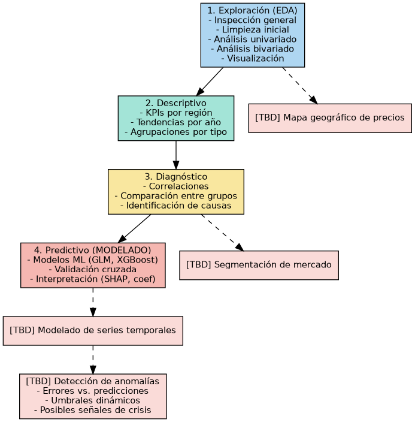
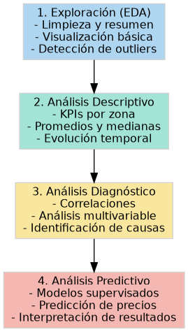

#  Análisis exploratorio y modelado predictivo de precios residenciales en Dinamarca (1992–2024)

Kaggle dataset: [Danish Residential Housing Prices 1992-2024](https://www.kaggle.com/datasets/martinfrederiksen/danish-residential-housing-prices-1992-2024/data) 

## 1. Descripción del caso de uso

El precio de la vivienda es un tema socioeconómico de gran relevancia, pues la compra de una casa suele ser la inversión más importante en la vida de una familia[1]. En Dinamarca, al igual que en muchos países, el mercado inmobiliario ha experimentado notables alzas de precios en las últimas décadas. Por ejemplo, el precio promedio de una vivienda unifamiliar aumentó **153,9% en términos reales** entre 1992 y 2020[2]. Estas fluctuaciones incluyen periodos de **boom** seguidos de ajustes: antes de la crisis financiera de 2008 los precios crecieron aceleradamente y luego cayeron \~20% para 2009, recuperándose en la década siguiente[2]. Este comportamiento cíclico ha generado interrogantes sobre la existencia de burbujas inmobiliarias y la sostenibilidad de los precios respecto a fundamentos económicos[2].

Dada la importancia de la vivienda tanto para la economía nacional como para el bienestar social, **analizar y predecir los precios de las viviendas** resulta fundamental. Una predicción precisa ayuda a compradores y vendedores a tomar decisiones informadas, a la vez que permite a planificadores y entidades financieras evaluar riesgos. Modelos de *machine learning* ya han mostrado eficacia en la predicción de precios inmobiliarios[4], pudiendo descubrir patrones ocultos en los datos históricos. En este proyecto, proponemos aplicar técnicas de Big Data y aprendizaje supervisado para **encontrar patrones y predecir el precio de viviendas residenciales en Dinamarca** usando datos históricos de 1992 a 2024. Se busca no solo alta precisión predictiva sino también **interpretabilidad**, de modo que los resultados brinden conocimiento claro sobre **qué factores influyen** en el precio (por ejemplo, ubicación, tamaño, antigüedad, etc.). Esto está alineado con la tendencia hacia **IA explicable**, utilizando métodos como SHAP o LIME para interpretar modelos complejos[5]. En resumen, el caso de uso se enfoca en demostrar cómo el análisis de grandes volúmenes de datos inmobiliarios puede apoyar la toma de decisiones en el mercado de la vivienda, un ámbito de gran impacto económico y social.

---
## 2. Descripción del conjunto de datos

El conjunto de datos utilizado proviene de la plataforma Kaggle (aporte de Martin Frederiksen, 2024) e incluye ~1,5 millones de registros de ventas de viviendas residenciales en Dinamarca, cubriendo el período 1992 a 2024. Cada fila representa una transacción inmobiliaria residencial real durante esos 32 años, recopiladas originalmente de registros oficiales de ventas. El dataset completo (`.parquet`) contiene aproximadamente **1.5 millones de registros** de ventas de viviendas residenciales en Dinamarca durante el período **1992 a 2024**.

---

## 🏷️ Columnas disponibles (Cleaned files)

| Nº  | Nombre columna                                 | Descripción                                                                                         | Observaciones                            |
|-----|------------------------------------------------|-----------------------------------------------------------------------------------------------------|------------------------------------------|
| 0   | `date`                                         | Fecha de la transacción                                                                             | —                                        |
| 1   | `quarter`                                      | Trimestre según calendario estándar                                                                 | —                                        |
| 2   | `house_id`                                     | ID único de vivienda                                                                                | Puede eliminarse                         |
| 3   | `house_type`                                   | Tipo de vivienda: `'Villa'`, `'Farm'`, `'Summerhouse'`, `'Apartment'`, `'Townhouse'`               | —                                        |
| 4   | `sales_type`                                   | Tipo de venta: `'regular_sale'`, `'family_sale'`, `'other_sale'`, `'auction'`, `'-'`              | `'-'` puede eliminarse                   |
| 5   | `year_build`                                   | Año de construcción (rango 1000–2024)                                                               | Se puede restringir más                  |
| 6   | `purchase_price`                               | Precio de compra en coronas danesas (DKK)                                                           | —                                        |
| 7   | `%_change_between_offer_and_purchase`          | Variación % entre precio ofertado y precio de compra                                                | Puede ser negativa, cero o positiva      |
| 8   | `no_rooms`                                     | Número de habitaciones                                                                              | —                                        |
| 9   | `sqm`                                          | Metros cuadrados                                                                                   | —                                        |
| 10  | `sqm_price`                                    | Precio por metro cuadrado (precio_compra / metros cuadrados)                                        | —                                        |
| 11  | `address`                                      | Dirección                                                                                           | —                                        |
| 12  | `zip_code`                                     | Código postal                                                                                       | —                                        |
| 13  | `city`                                         | Ciudad                                                                                              | —                                        |
| 14  | `area`                                         | Área geográfica: `'East & mid jutland'`, `'North jutland'`, `'Other islands'`, `'Copenhagen'`, etc. | —                                        |
| 15  | `region`                                       | Región: `'Jutland'`, `'Zealand'`, `'Fyn & islands'`, `'Bornholm'`                                   | —                                        |
| 16  | `nom_interest_rate%`                           | Tasa de interés nominal danesa por trimestre (no convertida a formato trimestral)                  | —                                        |
| 17  | `dk_ann_infl_rate%`                            | Tasa de inflación anual danesa por trimestre (no convertida)                                       | —                                        |
| 18  | `yield_on_mortgage_credit_bonds%`              | Tasa de bonos hipotecarios a 30 años (sin spread)                                                   | —                                        |

---

## 3. Enfoque metodológico

### Objetivo general

Desarrollar un análisis exploratorio (EDA) y un modelo predictivo explicable de los precios de viviendas residenciales en Dinamarca entre 1992 y 2024, utilizando técnicas de Big Data para identificar patrones, factores relevantes y posibles anomalías en el mercado inmobiliario. (cita al informe)

---

### Objetivos específicos

1. **Explorar y limpiar** el dataset de precios de viviendas, identificando valores atípicos y patrones generales.
2. **Analizar** de forma univariada y bivariada las variables clave (precios, metros cuadrados, ubicación, etc.).
3. **Determinar** relaciones entre variables que influyen significativamente en el precio de una vivienda.
4. **Construir** modelos supervisados de predicción de precios, priorizando precisión e interpretabilidad.
5. **Detectar** posibles anomalías estructurales en el mercado, como burbujas o rupturas de tendencia, usando análisis de residuales en series temporales.

---

### Preguntas orientadoras

* ¿Qué factores tienen mayor impacto en el precio de una vivienda en Dinamarca?
* ¿Qué diferencias existen entre regiones y tipos de vivienda?
* ¿Se pueden detectar cambios anómalos o inusuales en el mercado a lo largo del tiempo?
* ¿Qué tan precisas y explicables pueden ser las predicciones de precios usando modelos de ML?

---

### Metodología general

* **Tipo de estudio**: Cuantitativo, correlacional, longitudinal (1992–2024).
* **Enfoque**: Basado en ciencia de datos y aprendizaje automático.
* **Técnicas**:

  * Limpieza y transformación de datos con H2O/Pandas
  * EDA con análisis univariado, bivariado y visualización
  * Modelado predictivo con H2O AutoML, XGBoost y GLM
  * Interpretabilidad con SHAP o coeficientes
  * Detección de anomalías sobre residuales de series temporales

*Figura V. Pipeline metodológico para el análisis y predicción de precios de vivienda

## Analisis de datos

*Figura X. Flujo de trabajo general del análisis de datos y predicción de precios con tareas proyectadas (TBD)*
<!-- Verificar como agregar una descripcion a una imagen en MD -->

##  Análisis exploratorio de los datos (EDA).  

Se debe incluir la descripción  de 
las  tareas  de  inspección,  preprocesamiento,  análisis  univariado,  bivariado  y 
visualización de los datos.  
  

*Figura Y. Flujo secuencial del análisis realizado*

## Modelización.  Comprende  la  aplicación  de  los  algoritmos  de  aprendizaje 
supervisado sobre la plataforma de Big Data llamada H2O y los compara.  
  
 Resultados. Comunicar los principales resultados obtenidos (uso de métricas 
y tablas comparativas).  
  
 Conclusiones. En un párrafo redactar las conclusiones del trabajo, 
especificando la técnica utilizada, los resultados obtenidos (positivos o no).  
  
 Recomendaciones. Redactar los trabajos futuros.  
  
 Referencias bibliográficas 

### Referencias Bibliográficas

 [1] Montero, J., & Fernández-Avilés, G. (2017). La importancia de los efectos espaciales en la predicción del precio de la vivienda: una aplicación geoestadística en España. Papeles de Economía Española, 152, 102-117. https://www.funcas.es/wp-content/uploads/Migracion/Articulos/FUNCAS_PEE/152art08.pdf

[2] Larsen, K. (2020). An Assessment of the Danish Real Estate Market. MSc Thesis, Copenhagen Business School. https://research-api.cbs.dk/ws/portalfiles/portal/66775988/1043309_An_Assessment_of_the_Danish_Real_Estate_Market_.pdf

[3] Datsko, A. (2023). ANÁLISIS Y PREDICCIÓN DEL PRECIO DE LA VIVIENDA
EN MADRID UTILIZANDO TÉCNICAS DE EXPLORACIÓN DE DATOS E INTELIGENCIA ARTIFICIAL IMPLEMENTADAS EN PYTHON. Universidad Politecnica de Madrid. https://oa.upm.es/80281/1/TFG_DATSKO_ARTEM.pdf

[4] Nussupbekova, T. (2025). Denmark's Residential Property Market Analysis 2025.https://www.globalpropertyguide.com/europe/denmark/price-history

[5] Copper, A. (2021).Explaining Machine Learning Models: A Non-Technical Guide to Interpreting SHAP Analyses. Aidan Cooper. https://www.aidancooper.co.uk/a-non-technical-guide-to-interpreting-shap-analyses